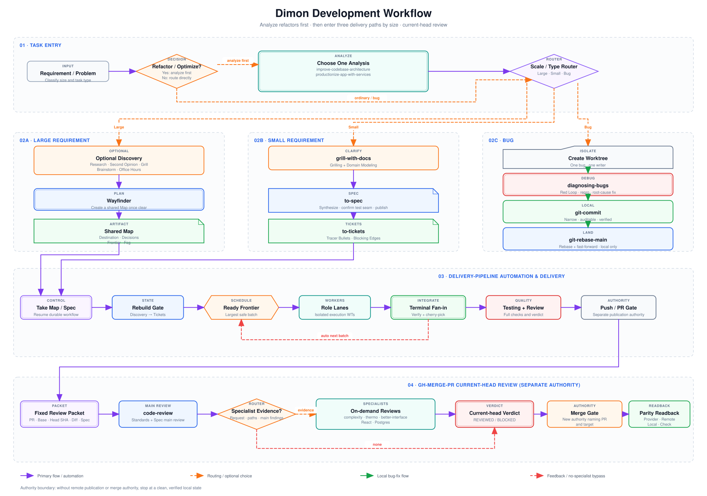

# Agent Development Workflow

[中文](README.zh-CN.md)

This repository combines requirement shaping, map planning, spec and ticket creation, automated dispatch, and local Git closeout into one resumable development workflow. `skills/` is the canonical source for Skills owned here. Third-party Skills stay in their upstream clones and are consumed through symlinks.



## Three Entry Paths

| Task type | Workflow |
| --- | --- |
| Large requirement | Use `research`, Second Opinion, `grill-with-docs`, `brainstorming-only`, or `office-hours-only` as needed → create a shared Map with `wayfinder` → let `delivery-pipeline` advance it automatically |
| Small requirement | `grill-with-docs` → `to-spec` → `to-tickets` → hand the published Spec to `delivery-pipeline` |
| Bug | isolated Worktree → `diagnosing-bugs` → `git-commit` → `git-rebase-main` |

The pre-map tools are selected by the problem. They are not a fixed sequence and do not all have to run. Pushes, pull requests, and remote merges always require separate authority.

## Install the Skill Bundle Once

```bash
git clone https://github.com/Dimon94/skills.git \
  "$HOME/.local/share/dimon-agent-workflow/skills"
cd "$HOME/.local/share/dimon-agent-workflow/skills"
./scripts/install-development-workflow.sh
./scripts/install-development-workflow.sh --check
```

The script clones or fast-forwards the dependency repositories, then links every Skill required by this workflow into `~/.agents/skills` and `~/.claude/skills`. It refuses to replace a real directory with a symlink. A dependency checkout with local changes is preserved and not updated.

To let an AI Agent inspect the environment, install runtime dependencies, and verify the result, paste the prompt from the [one-paste Agent bootstrap guide](docs/agent-bootstrap.md).

## Dependency Repositories

| Repository | Workflow responsibility | Standalone install |
| --- | --- | --- |
| [Dimon94/skills](https://github.com/Dimon94/skills) | Local delivery Skills such as `git-commit` and `git-rebase-main` | [`scripts/link-skills.sh`](scripts/link-skills.sh) |
| [mattpocock/skills](https://github.com/mattpocock/skills) | Research, grilling, Wayfinder, specs, tickets, implementation, and review | [Installation](https://github.com/mattpocock/skills#installation-30-second-setup) |
| [Dimon94/delivery-pipeline](https://github.com/Dimon94/delivery-pipeline) | Automated dispatch, integration, testing, and review from a Map or Spec | [Install](https://github.com/Dimon94/delivery-pipeline#install) |
| [Dimon94/brainstorming-only](https://github.com/Dimon94/brainstorming-only) | `brainstorming-only` and `office-hours-only` | [Quick Install](https://github.com/Dimon94/brainstorming-only#quick-install) |
| [fireworks-tech-graph](https://github.com/yizhiyanhua-ai/fireworks-tech-graph) | Generate and validate architecture, flow, and technical diagrams | [Installation](https://github.com/yizhiyanhua-ai/fireworks-tech-graph#installation) |
| [Second Opinion](https://github.com/Dimon94/codex-with-chatgpt) | Optional high-level planning and independent review | [One-paste install](https://github.com/Dimon94/codex-with-chatgpt#one-paste-install--一段话安装) |
| [Herdr](https://github.com/thinkerisme/herdr) | Terminal multi-agent runtime used by `delivery-pipeline` | [Install](https://herdr.dev/install) |

`delivery-pipeline` also needs at least one installed worker CLI: pi, Codex CLI, or Claude CLI. Codex App uses native Tasks and Worktrees and does not require Herdr.

## Repository Boundary

- `AGENTS.md`: repository working contract.
- `CONTEXT.md`: canonical vocabulary.
- `docs/architecture/current-system-map.md`: modules, dependencies, and verification entry points.
- `skills/`: the only source of truth for Skills owned here.
- `scripts/link-skills.sh`: links only the Skills owned here.
- `scripts/install-development-workflow.sh`: installs the complete development-workflow Skill Bundle.

Third-party Skills are never copied into this repository. Update their upstream checkout and every symlink immediately consumes the new content.
