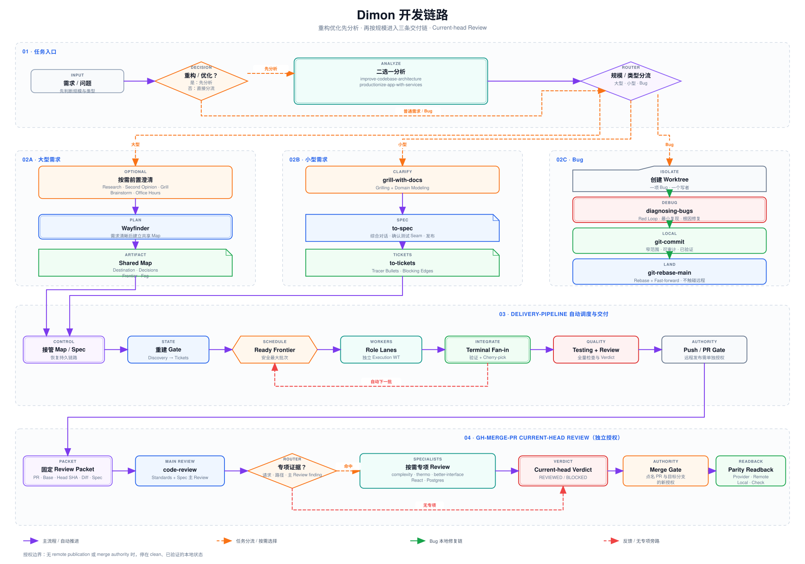

# Agent 开发链路

[English](README.md)

这套仓库把需求澄清、地图规划、规格拆票、自动调度和本地 Git 收口组合成一条可恢复的开发链路。`skills/` 是 Agent 读取的 Canonical source；第三方套件只收录工作流实际使用的上游快照，独立单-Skill 项目通过上游 clone 与 symlink 接入。



## 任务分流

| 任务类型 | 链路 |
| --- | --- |
| 大型需求 | 按需使用 `research`、Second Opinion、`grill-with-docs`、`brainstorming-only` 或 `office-hours-only` → `wayfinder` 建共享 Map → `delivery-pipeline` 自动推进 |
| 小型需求 | `grill-with-docs` → `to-spec` → `to-tickets` → `delivery-pipeline` 接管 Spec |
| 重构或优化 | 使用 `improve-codebase-architecture` 或 `productionize-app-with-services` 二选一分析 → 按分析所得工作量重新判断需求规模 → 进入上面的大型或小型需求链路 |
| Bug | 独立 Worktree → `diagnosing-bugs` → `git-commit` → `git-rebase-main` |

前置澄清工具按问题选择，不是固定顺序，也不要求全部执行。重构和优化分析也是分流前置步骤，不是独立交付链。Push、PR 和远程合并始终需要单独授权。

PR 进入审查后，`gh-merge-pr` 先冻结一个 Review Packet，以 `code-review` 完成 Standards 与 Spec 主 Review；只有用户请求、changed paths 或主 Review finding 提供证据时，才增加专项 Review。Current-head Verdict 通过后，才能在新的独立授权下合并并完成 parity readback。

## 一次安装 Skill Bundle

```bash
git clone https://github.com/Dimon94/skills.git \
  "$HOME/.local/share/dimon-agent-workflow/skills"
cd "$HOME/.local/share/dimon-agent-workflow/skills"
./scripts/install-development-workflow.sh
./scripts/install-development-workflow.sh --check
```

脚本会 clone 或快进更新独立依赖仓库，并把本仓 Skill、精选上游快照和独立项目 Skill 链入 `~/.agents/skills` 与 `~/.claude/skills`。它拒绝覆盖同名普通目录；外部 checkout 有本地改动时会保留改动并跳过更新。

让 AI Agent 处理环境识别、运行时依赖和验证时，直接复制 [Agent 一次安装指南](docs/agent-bootstrap.md) 中的提示词。

## 依赖仓库

| 仓库 | 链路职责 | 独立安装 |
| --- | --- | --- |
| [Dimon94/skills](https://github.com/Dimon94/skills) | `git-commit`、`git-rebase-main` 等本地交付 Skill | [`scripts/link-skills.sh`](scripts/link-skills.sh) |
| [mattpocock/skills](https://github.com/mattpocock/skills) | Research、Grilling、架构分析、Wayfinder、Spec、Tickets、实现与 Review | [Installation](https://github.com/mattpocock/skills#installation-30-second-setup) |
| [swyxio/skills](https://github.com/swyxio/skills) | 精选 `productionize-app-with-services` 上游快照的来源 | 由本仓安装脚本一并安装 |
| [humanlayer/skills](https://github.com/humanlayer/skills) | 精选 `show-me` 上游快照的来源 | 由本仓安装脚本一并安装 |
| [Kappaemme-git/codex-complexity-optimizer](https://github.com/Kappaemme-git/codex-complexity-optimizer) | 独立的 `complexity-optimizer` Skill | 本仓安装脚本直接关联 |
| [Dimon94/delivery-pipeline](https://github.com/Dimon94/delivery-pipeline) | 从 Map 或 Spec 接管自动调度、集成、测试与 Review | [Install](https://github.com/Dimon94/delivery-pipeline#install) |
| [Dimon94/brainstorming-only](https://github.com/Dimon94/brainstorming-only) | `brainstorming-only` 与 `office-hours-only` | [Quick Install](https://github.com/Dimon94/brainstorming-only#quick-install) |
| [fireworks-tech-graph](https://github.com/yizhiyanhua-ai/fireworks-tech-graph) | 生成和校验架构图、流程图与技术图 | [Installation](https://github.com/yizhiyanhua-ai/fireworks-tech-graph#installation) |
| [Second Opinion](https://github.com/Dimon94/codex-with-chatgpt) | 可选的高阶方案讨论与独立审查 | [One-paste install](https://github.com/Dimon94/codex-with-chatgpt#one-paste-install--一段话安装) |
| [Herdr](https://github.com/thinkerisme/herdr) | `delivery-pipeline` 的终端多 Agent 调度运行时 | [Install](https://herdr.dev/install) |

`delivery-pipeline` 还需要至少一个已安装的 Worker CLI：pi、Codex CLI 或 Claude CLI。Codex App 使用原生 Task/Worktree 时不依赖 Herdr。

## 仓库边界

- `AGENTS.md`：本仓工作的总合同。
- `CONTEXT.md`：统一语言与 canonical term。
- `docs/architecture/current-system-map.md`：模块、依赖与验证入口。
- `skills/`：本仓自有 Skill 与精选上游快照的 Canonical source。
- `scripts/link-skills.sh`：链接 `skills/` 中的自有 Skill 与上游快照。
- `scripts/install-development-workflow.sh`：安装完整开发链路 Skill Bundle。
- `skills/sync-upstream-skills/references/sources.json`：上游快照的来源、路径、commit 与内容 hash。

运行 `$sync-upstream-skills` 检查精选快照；明确要求更新后才写入。独立单-Skill 项目仍更新对应上游 clone，symlink 会立即读取新内容。
